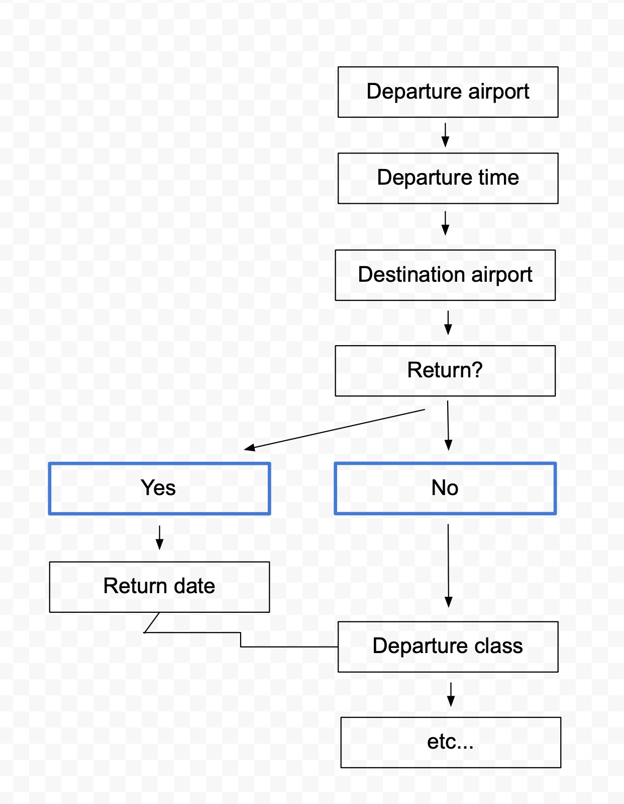

# Interaction
The flow of a chatbot conversation needs to have a mixture of free text and closed interactions.
For example, if the user says:

### "I want to book a flight"
```
{
    sender: 'user',
    message: {
        type: 'text',
        content: 'I want to book a flight',
        intentObj: {
            domain: 'flights',
            intent: 'book'
        }
    }
}
```

This is the perfect time to start an interaction/tree or whatever I should call it.
Basically a series of questions and answers, some pure text, some Yes/No questions, some 'select option' things etc. to get information for a specific purpose. In this case to book a flight, other examples: book a hotel room, transfer money, book a train, file an insurance claim etc.

The interaction is like a decision tree in that each answer determines which path the user will take. (What the next questions will be.)

In this case,


### Last message in the msg_log:
```
{
    sender: 'user',
    message: {
        type: 'text',
        content: 'I want to book a flight from Amsterdam Airport',
        intentObj: {
            ..
            entities: {
                departureAirport: 'AMS'
            }
        },

        # The above (type, content, intent object etc.) are determined first, then
        # in the function defined for that intent an interaction is initiated, and the
        # interaction
        interaction: {
            initiate: 1, # id of interaction

            # dictionary of entities from the message to transfer over to the interaction
            # so that the user doesn't need to be asked again.
            entities: {
                departureAirport: 'departureAirport',
                # key: name of value in the interaction
                # value: name of the entity we are getting from intentObj.entities
            }
        }
    }
}
```

### Interaction
- Put interaction dictionary inside the msg_log in the order it appears.
```
{
    id: 1,
    initiatedBy: 1,
    entities: {
        returnFlightOrReturn: 'return',
        departureDate: '2018/12/21',
        returnDate: '2018/01/06'
    },
    messages: [
        {
            sender: 'bot',
            id: 1,
            message: {
                type: 'select_options',
                text: 'Return flight or one-way?',
                options: [
                    {'label': 'One-way', msg: 'One way my friend!', value='oneway'},
                    {'label': 'Return',  msg: 'Return please!',     value='return'}
                ],
                settings: {
                    'maxSelect': 1,
                },
                'fillEntity': 'returnFlightOrReturn',
            }
        },
        {
            sender: 'user',
            previous: 1, # reply to message with id 1, LinkedList style
            id: 2,
            message: {
                type: 'select_options',
                text: 'Return please!',
            }
        },
        {
            sender: 'bot',
            id: 3,
            previous: 2,
            message: {
                type: 'select_dates', # select dates custom widget
                text: 'Select your departure and return dates.',
                settings: {
                    calendarStyle: 'http://alfred.ai/custom/calendar/KLM-Custom-Calendar-Widget' # something like this for custom widgets
                },
                fillEntities: ['departureDate', 'arrivalDate'],
            }
        },
        {
            sender: 'user',
            id: 4,
            previous: 3,
            message: {
                type: 'select_dates',
                text: 'Departure: 21. December 2018, Return: 6. January 2019',
                value: ['2018/12/21', '2018/01/06'],
            }
        }

        # etc...
    ]
}
```

### Hard part
I don't want to hard code every damn interaction tree of course. So I want to create a feature in the admin panel where we (Alfred) can create interaction trees. I.e. the structure of the tree (different paths it can take based on answers to questions, as shown above in the illustration), what kind of widget to use for each question (select_options, calendar, pure text etc.),
